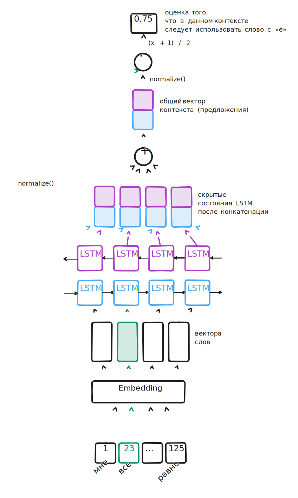

# Карточка модели

## Общая информация

Рекуррентная модель для восстановления буквы Ё с учётом контекста — WordBiLSTM.

- Автор: Павлович Олег — @stllfe
- Дата эксперимента: 14/11/2023

## Описание

Реккурентная модель и задача классификации последовательности. Работает на словах, используя предобученные эмбеддинги из проекта [Navec](https://github.com/natasha/navec).

Задача модели — закодировать контекст предложения в «полезный» вектор, который далее сравнивается с эмбеддингом целевого слова для замены с помощью скалярного произведения. Если результат сравнения после сигмоиды $\in[0, 1]$ больше некоторого порогового значения, производим замену.

Задача бинарной классификации последовательности выбрана из-за своей простоты в реализации и некоторых предположений о данных:

- В одном предложении редко встречается сразу несколько слов с Ё
- У каждого слова с Ё свой релевантный контекст в предложении, который определяет какой вариант написания требуется (крайне редко одно слово с Ё определяет другое слово с Ё)

## Данные

Дамп русской Википедии, сбалансированный по частоте встречаемости вариантов слов с Е и с Ё. Подробнее в разделе [проектной документации](../docs/development.md).

**Важно:** данные были разбиты на обучающую и тестовую выборку, однако при обучении в качестве валидации использовалась небольшая подвыборка первых K сэмплов (см. `num_eval_samples` в [params.yaml](../params.yaml)). Таким образом, есть риск смещенной оценки и переобучения под тест.

## Метрики

В ходе работы были добавлены отдельно значения FN, FP для отслеживания баланса между ошибками первого и второго рода, а также F-Beta мера со значением $beta=0.5$ (в коде используется сокращение — FH от англ. half), поскольку нам может быть важнее точность замены, а не полнота поиска: лучше точно заменить меньше слов, в которых модель уверена, чем заменить больше слов, но с ошибками. Тем не менее при обучении мониторировалась именно F1-мера, а не FH. В конечном итоге, мы хотели бы и находить все слова для замены, и корректно определять их вариант написания.

## Архитектура модели

Модель — двунаправленная LSTM (Long Short-Term Memory). Выбрана в качестве первой итерации против бейслайна, как наиболее простая модель, которая может учитывать временную компоненту при кодировании контекста. Лично для меня была чуть проще в реализации, чем CNN. Решил сразу использовать двунаправленную (кодирование слева-направа и справа-налево), поскольку в условиях задачи мы получаем на вход сразу всё предложение для замены. На практике, двунаправленные LSTM работают лучше для задачи классификации текстов.

После прогона слов контекста через BiLSTM, хиддены пулятся суммой в один вектор. Полученный вектор и вектор эмбеддинга целевого слова-омографа приводятся к единичной норме и сраниваются с помощью скалярного произведения. Полученный $x \in [-1, 1]$ приводится к отрезку $[0, 1]$ и используется как оценка необходимости использовать вариант омографа с «ё» в данном контексте.

## Гиперпараметры

Модель архитектурно очень простая, но можно подобрать:

- глубину BiLSTM: `num_layers`
- вероятность dropout между слоями: `dropout`

Прочие гиперпараметры стандартны — размера шага оптимизации, батча, параметры регуляризации, количество эпох и другие (см. секцию `model.train` в [params.yaml](../params.yaml)).

## Предобработка

Два важных момента в реализации предобработки:

- Токенизатор бьёт текст по словам, но разбивает слова с дефисом ([tokenizer.py](../yoric/models/wordrnn/tokenizer.py)): `'всё-таки' -> ['всё', 'таки']`. Это сделано так, поскольку в словаре очень мало вариаций слов с частицами через дефис, и при произвольном добавлении `-[то,либо,нибудь,таки,...]` модель будет обрабатывать слово как `<unk>`, что, конечно же, некорректно
- Батч формируется итеративно, набирая семплы из датасета. При ошибке в подготовке семпла — он откидывается (см. [data.py](../yoric/models/wordrnn/data.py))

## Процедура обучения

Обучение происходило на RXT 3070 8Gb в среднем за ~10-20 минут.

В ходе обучения использовался достаточно тривиальный график `learning_rate` — уменьшение при попадании на плато.

## Ограничения

*На каких кейсах модель не будет работать или результат будет непредсказуем.*

Основное ограничение — использование предобученных эмбеддингов и, соответственно, фиксированного словаря. Предварительно перед использованием был проведен анализ покрытия ТОП-100 наиболее частотных слов-омографов с «ё» — они входят в словарь. Как бы то ни было, не гарантируется работа модели на хвостах распределения.

Очевидно, любые out-of-vocabulary слова не орабатываются. Отчасти поэтому у модели стабильно высокий False Negative Rate (относительно бейслайна) на тестовой выборке, поскольку много слов просто не находятся в словаре.

Также модель игнорирует знаки пунктуации и регистр букв. Первое может в некоторых примерах выступать важным фактором при разрешении омографии:
«все, выдохнули!» против «все выдохнули!» — в первом случае вариант со «всё» кажется предпочтительнее.

## Дальнейшая работа

*Что можно попробовать далее на базе эксперимента, как улучшить предложенное решение?*

Для текущей реализации:

- Анализ ошибок модели на срезах данных (частотные, редкие слова)
- Перебор гиперпараметров
- Проверка битых семплов при формировании батча
- Архитектурно:
  - попробовать механизм внимания вместо пулинга суммой
  - попробовать GRU вместо LSTM
- Улучшение быстродействия
  - Реализовать bucketing вместо padding (или вместе с ним)
  - Обработка батчами на инференсе
- Поиск и устранение причин высокого FNR
- Переход от предобученных векторов к своему словарю на основе датасета
- Обработка out-of-vocabulary слов
  - другой вариант токенизации, например, стемминг + отдельно окончания + подслова (N-граммы символов), чтобы иметь большее покрытие произвольных текстов
  - другие виды векторизации, например, FastText
- Рефакторинг кода (см. комменты `todo`)

Общие:

- Формирование корректной валидации (аналогично, с балансом обоих вариантов омографа)
- Дополнение и уточнение словарей с «ё»
- Поиск и корректировка ошибок в разметке
